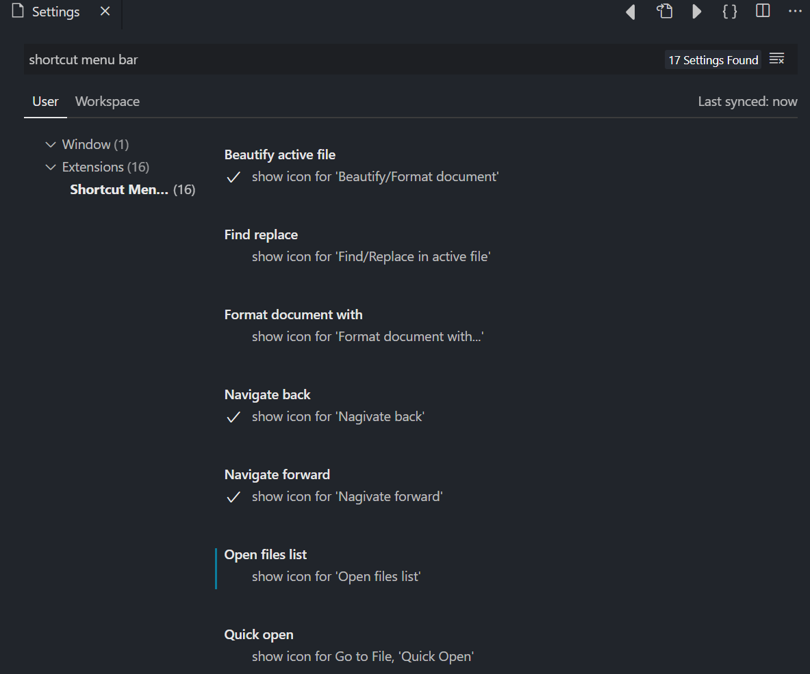

# Shortcut Menu Bar VSCode Extension

Add buttons to editor menu toolbar like beautify, show opened files, save, toggle terminal, activity bar, Find replace etc to the editor menu bar in the Visual Studio Code. Make use of that empty menu bar! Increase productivity!

---

## 📷 Screenshot

## ⚙ Enable/Disable buttons from VSCode settings

---

## ✅ Currently Added Buttons

- Save active file
- Navigate back
- Navigate forward
- Beautify/format document or selection
- Beautify/format document or selection with multiple formatters
- Undo/Redo buttons
- Open files list
- Save all
- show/hide terminal
- show/hide render whitespace
- Quick open (Ctrl+P)
- show/hide activity bar
- Find & replace in active file (Ctrl+H)
- Switch header source (for .cpp files)
- Toggle line comment
- Open file, New file
- Go to definition
- Cut, Copy, Paste
- Start Debugging

---

### ❤ Support continuous development [Buy me a Coffee](https://ko-fi.com/gorvgoyl)

  

  

### 👍 Liked the extension? Rate it [⭐⭐⭐⭐⭐](https://marketplace.visualstudio.com/items?itemName=jerrygoyal.shortcut-menu-bar)

---

### FAQ 🙋‍

**Why Can't I add my own/custom buttons?**  
Because it's a limitation in VSCode, you can't modify [package.json](https://code.visualstudio.com/api/references/extension-manifest) of extension where the buttons are configured. I wish if someone finds a workaround!

**Can you add 'xyz' button for me?**  
Sure, you can request a button by creating a github issue here https://github.com/gorvgoyl/Shortcut-Menu-Bar-VSCode-Extension/issues
Please note that it would take some time as I am usually occupied with many things.
You can also make changes to [repo](https://github.com/gorvgoyl/Shortcut-Menu-Bar-VSCode-Extension/) and send me a PR to speed-up the process.

**How can I add buttons / Can I contribute to repo to add my button?**  
To add buttons see "Adding new buttons" section of `Help.md` file.
Go through the [repo](https://github.com/gorvgoyl/Shortcut-Menu-Bar-VSCode-Extension/), it's fairly simple to understand code and add a button. Send me a PR!  
Few resources: https://code.visualstudio.com/docs/getstarted/keybindings
https://code.visualstudio.com/docs/extensionAPI/vscode-api

**How can I disable/Enable a button?**  
By going to vscode settings (`CTRL+,` or `CMD+,`) and search for "shortcut menu bar". see above screenshot.

---

Report bugs: https://github.com/gorvgoyl/Shortcut-Menu-Bar-VSCode-Extension/issues
