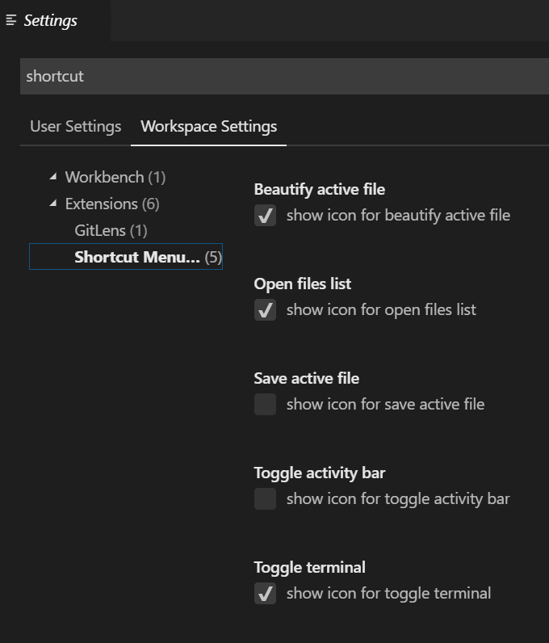

# Shortcut Menu Bar VSCode Extension

Add buttons to editor menu bar like beautify, show opened files, save, toggle terminal, activity bar, Find replace etc to the editor menu bar in the Visual Studio Code. Make use of that empty menu bar! Increase productivity!

- - -

## **Screenshot** 📷

## **Enable/Disable buttons in extension settings ⚙**

- - -

### **Currently Added Buttons ✅**

* Save active file
* Navigate back
* Navigate forward
* Beautify/format code active file
* show/hide render whitespace
* Open files list
* show/hide terminal
* show/hide activity bar
* Quick open (Ctrl+P)
* Find & replace in active file (Ctrl+H)
* Switch header source (for .cpp files)

##### Liked the extension? Rate it ⭐⭐⭐⭐⭐

#### Want more buttons? see FAQ 👇

- - -

### FAQ 🙋‍

**Why Can't I add my own/custom buttons?**
Because it's a limitation in VSCode, you can't modify [package.json](https://code.visualstudio.com/api/references/extension-manifest) of extension where the buttons are configured.

**Can you add 'xyz' button for me?**  
Sure, you can request a button by creating a github issue here https://github.com/JerryGoyal/Shortcut-Menu-Bar-VSCode-Extension/issues
Please note that It would take some time as I am usually occupied with many things.
You can also make changes to [repo](https://github.com/JerryGoyal/Shortcut-Menu-Bar-VSCode-Extension/) and send me a PR to speed-up the process.

**Can I contribute to repo to add my button?**  
Yes, Please. Just go through the [repo](https://github.com/JerryGoyal/Shortcut-Menu-Bar-VSCode-Extension/), it's fairly simple to understand code and add a button. Send me a PR!  
Few resources: https://code.visualstudio.com/docs/getstarted/keybindings
https://code.visualstudio.com/docs/extensionAPI/vscode-api

**How can I disable/Enable a button?**  
By going to extension settings. see above screenshot.

- - -

 Report Bugs/Suggest Features: https://github.com/JerryGoyal/Shortcut-Menu-Bar-VSCode-Extension/issues

- - -

## Release Notes

### 1.2

* added quick open/go to file.. Ctrl+P
* added Find/replace.. Ctrl+H
* improved readme

### 1.0.1

* added navigate back and forward buttons
* added switch header and source file button
* added toggle render whitespace button

### 1.0.0

* user can now hide/show icons in settings
* added toggle terminal, activity bar

### 0.1.5

* Fixed issue to properly show "opened files"

### 0.1.2

* Initial Release

- - -

 
 
